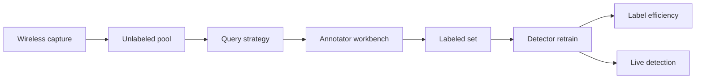

# AskShield

**Source:** `ai-in-iot/1808.01412v1/`
**Domain:** `ai-iot`
**One-liner:** A human-in-the-loop active learning IDS for wireless IoT that queries analysts only for the most informative unlabeled flows, so teams reach high detection accuracy without labeling oceans of traffic.
**Wedge:** Wireless IoT estates (Wi-Fi, BLE, NB-IoT, emerging 5G) where SOC talent is scarce, labeled attack data is thin, and power/memory limits block heavy always-on deep models at the node.
**Positioning:** Active-learning wireless IoT IDS. Misuse signatures miss unknowns; anomaly detectors flood false alarms; supervised ML stalls without labels. AskShield productizes uncertainty sampling, query-by-committee, and related query strategies so humans label the few instances that shrink version space fastest — the paper’s core claim that careful querying matches classic ML accuracy with far fewer labels.

## Market research synthesis

### Thesis from source

Wireless is the de facto IoT interconnect (NB-IoT, Wi-Fi, BLE; 5G on the horizon), but IoT nodes are power- and memory-limited, channels are constrained, and globally addressable endpoints widen attack exposure (e.g., DoS). IDS design therefore differs from enterprise network IDS. Misuse-based detection has low false positives on known signatures but high false negatives on unknowns and needs constant rule updates. Anomaly-based detection finds novel attacks but generates huge false-alarm volumes. Hybrids try to balance both.

Machine learning is widely studied for anomaly detection yet underused in practical IDS partly because labeling is expensive or impossible for never-before-seen intrusions, and domain knowledge is scarce. Active learning is framed as human-in-the-loop ML: a query engine selects unlabeled instances, a human annotator labels them, and the model retrains until target accuracy — achieving comparable accuracy with much less labeled data. The article reviews stream-based versus pool-based sampling and query strategies (uncertainty sampling, query-by-committee with vote entropy/KL disagreement, expected model change/EGL, expected error reduction, variance reduction, information density to avoid outliers). Experimental examples in the paper show significant improvement over traditional supervised learning under limited labels. The authors note HITL ML for IoT IDS is still nascent — the product opportunity.

### Buyer & economic model

- **Primary buyer:** CISO / Head of Detection Engineering for wireless-heavy IoT (factories, hospitals, campuses).
- **Users:** SOC analysts (annotators), detection engineers, wireless network admins, model operators.
- **Budget owner / value metric:** SOC labor and wireless security budget. Value metrics: labels per accuracy point, FPR, novel-attack recall, annotator hours per week.
- **Competing status quo:** signature wireless IDS; fully supervised models starved for labels; unsupervised anomaly scores without a labeling workflow.

### Domain constraints

- **Regulatory / trust / safety:** wrong labels poison the model; annotator access to payloads may expose sensitive IoT telemetry.
- **Data sensitivity:** wireless captures can include personal or clinical device traffic; query payloads need minimization.
- **Change-management realities:** analysts resist endless labeling queues; query strategy must cap daily label budget and explain why an item was asked.

## Business requirements

- BR-1: The platform must support pool-based and stream-based active learning modes appropriate to wireless capture architecture.
- BR-2: Operators must choose a query strategy (uncertainty, QBC, EGL, etc.) and see expected label budget to reach a target metric.
- BR-3: Daily annotator load must be hard-capped; excess candidates queue rather than overwhelm the SOC.
- BR-4: Each query must show why it was selected (uncertainty score, committee disagreement) so analysts trust the queue.
- BR-5: Models must report accuracy versus label count curves so leadership sees HITL ROI.
- BR-6: Label provenance (who, when, confidence) is mandatory for audit and poison investigation.
- BR-7: Payload minimization must redact sensitive fields before annotator display when policy requires.
- BR-8: Hybrid mode must allow signature hits to bypass labeling while anomalies enter the query pool.
- BR-9: Promotion gates require held-out performance at or above the supervised baseline trained on the full legacy label set using ≤ agreed label fraction.
- BR-10: Retraining after each annotation batch must not exceed a declared wireless-edge compute envelope when models run near the capture point.
- BR-11: Commercial packaging prices by wireless domains and included annotator seats.
- BR-12: Disagreement between annotators must escalate rather than silently average when safety classes are involved.

## User stories

Canonical user stories live in sibling [USER_STORIES.md](USER_STORIES.md).

## System design

### Overview

AskShield ingests wireless flow/feature pools, maintains unlabeled pools, runs configurable query strategies, presents minimized items to annotators, retrains detectors, tracks label efficiency curves, and promotes models under gates — with budget caps and provenance.

### Actors & boundaries

- **Actors:** annotators, detection engineers, wireless admins, model operators, capture sensors.
- **Trust boundary:** full PCAP stays in the security zone; annotators see minimized features by default. Model promotion is privileged.
- **Human-in-the-loop points:** every active label; strategy selection; promotion; dual review on safety classes.

### Core capabilities

1. **Capture domain onboarding** — wireless sites and feature extractors.
2. **Unlabeled pool/stream management** — pool vs stream modes.
3. **Query strategies** — uncertainty, QBC, EGL, and related.
4. **Annotation workbench** — budgeted queues with rationales.
5. **Model retrain loop** — incremental supervised updates.
6. **Label efficiency analytics** — accuracy vs labels.
7. **Provenance and poison controls** — who labeled what.
8. **Promotion and rollback** — gated releases.

### Conceptual data

- **Primary entities:** WirelessDomain, UnlabeledPool, QueryStrategy, QueryItem, Annotation, DetectorModel, LabelBudget, EfficiencyReport.
- **Critical events:** pool refreshed, query issued, annotation submitted, model retrained, budget exhausted, promotion, rollback, poison alert.
- **Retention / audit needs:** annotations and model versions retained for audit; raw captures minimized and time-bounded.

### Integrations (conceptual)

- **Systems of record:** wireless controllers, packet brokers, SIEM, identity for annotators.
- **Upstream signals:** flow features, RF anomaly sensors, signature IDS hits.
- **Downstream actions:** detector deploy, SOC tickets, budget alerts.

### High-level architecture

### Success metrics

- **Leading:** labels to target F1; annotator hours/week; query acceptance rate.
- **Lagging:** novel-attack recall versus signature IDS; FPR; incidents missed after promotion.

## OpenAPI skeleton

Canonical HTTP surface lives in sibling `openapi.yaml`. Summarize here:

- **Base path:** `/v1/...`
- **Auth:** API key and/or Bearer JWT (operator)
- **Resource groups:** Domains, Pools, Queries, Annotations, Models
