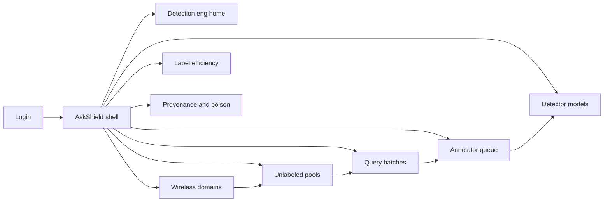
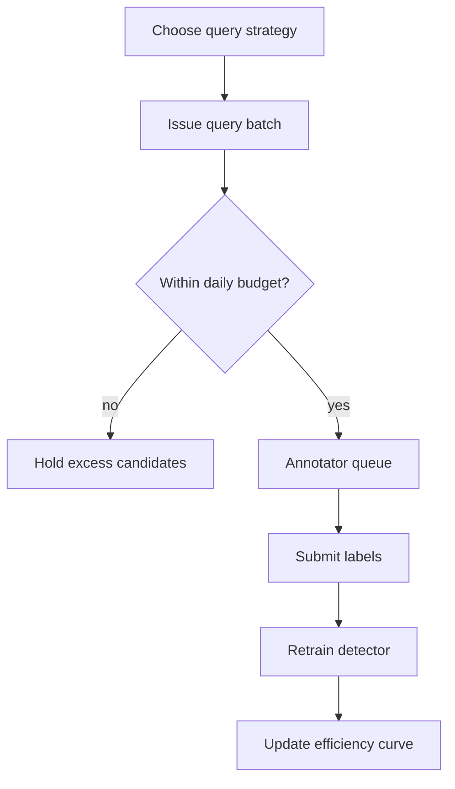

# AskShield — Web app

**Product:** [PRODUCT.md](./PRODUCT.md)
**Primary surface:** HITL wireless IDS console (annotator workbench + detection engineering)
**Secondary surfaces:** Label-efficiency board report (read-only); annotator provenance export for poison review
**Design thesis:** AskShield is a questioning IDS, not an alert firehose — the UI metaphor is a daily label ration ticket and a shrinking version-space curve. Visual language is cool graphite with signal-amber query highlights on a deep RF-night ground: each asked flow feels precious; exhausted daily budget feels like a closed window, not a backlog shaming the SOC. The brand wordmark sits as a quiet ask-mark on every annotation screen so analysts know whose scarce labeling hours the model is spending.

## UX research synthesis

### Category peers (best-in-class)

- **Labelbox / Snorkel Flow (HITL labeling):** Budgeted queues, reason codes, consensus workflows. Steal: daily label caps and dual review on safety classes; reject endless unlabeled oceans as the default UX.
- **Microsoft Sentinel / Elastic Security (detection engineering):** Analytics rules, promotion gates, versioned detectors. Steal: promotion vs rollback with held-out metrics; reject treating wireless IoT like generic IT NIDS without domain onboarding.
- **Cisco AI Endpoint Analytics / IoT Control Center:** Wireless/IoT device context beside detections. Steal: capture domain per SSID/site so guest and industrial stay separated; reject one global model for all RF.
- **Darktrace / Vectra (anomaly UX):** Novel vs known separation. Steal: signature hits bypass labeling while anomalies enter the query pool; reject unsupervised scores without a labeling workflow.

### Patterns to adopt / reject

- **Adopt:** Query rationale on every item (uncertainty / QBC disagreement); hard daily annotator caps; accuracy-vs-labels curve as the engineer home; payload minimization by default; hybrid signature bypass; dual annotator escalate on safety classes; poison alerts on swingy labelers.
- **Reject:** Infinite SOC labeling queues; black-box “AI selected this”; averaging disagreeing safety labels; unsupervised anomaly walls without HITL; purple glow “smart IDS”; PCAP dumps as the annotator primary view.

### Trust, density, and workflow constraints from PRODUCT.md

SOC talent is scarce (BR-3): the product must feel like a short informative queue, not unpaid overtime. Wrong labels poison detectors (BR-6, BR-12): provenance and dual review are first-class. Wireless captures are sensitive (BR-7): redaction before display. Strategy choice and ROI must be visible (BR-2, BR-5, BR-9): expected label budget and promotion gates vs full-label supervised baseline. Edge compute envelopes constrain retrain near capture (BR-10).

## Information architecture

### Nav model

### Roles → default home

| Role | Default home | Why |
|------|--------------|-----|
| SOC annotator | Annotator queue | Daily capped informative labels |
| Detection engineer | Label efficiency | Strategy and stop-labeling curve (BR-5) |
| Wireless network admin | Wireless domains | SSID/site separation |
| Model operator | Detector models | Promote / rollback / poison (BR-9) |
| Security administrator | Label budgets | Cap hours (BR-3, BR-11) |

### Cross-links to OpenAPI resources

| Nav area | OpenAPI tags / resources |
|----------|---------------------------|
| Wireless domains | Domains |
| Unlabeled pools | Pools |
| Query batches / items | Queries |
| Annotations | Annotations |
| Detector models, efficiency, promote | Models |

## Screen inventory

### Annotator queue

- **Purpose:** Deliver a short daily set of the most informative unlabeled flows with plain-language why-asked.
- **Entry:** Annotator login default; query batch deep link.
- **Layout regions:** Budget meter (labels left today); queue list; item detail with minimized features; rationale panel (uncertainty / committee disagreement); label controls; escalate dual-review.
- **Primary actions:** Label benign/attack/class; skip with reason; escalate safety class; end session when budget hits zero.
- **Empty / loading / error:** Empty = “budget closed or no informative items” (healthy); redaction failure blocks display.
- **BR / story ties:** BR-3, BR-4, BR-7; annotator stories.

### Detection engineering home

- **Purpose:** Compare query strategies and see accuracy versus label count so labeling stops when the curve flattens.
- **Entry:** Engineer login default.
- **Layout regions:** Strategy cards (uncertainty, QBC, EGL, etc.) with expected label budget; live efficiency curve; pool health; promotion candidates.
- **Primary actions:** Select strategy; run A/B on capture; open model promote; adjust daily team cap.
- **Empty / loading / error:** Empty = register first wireless domain + pool.
- **BR / story ties:** BR-2, BR-5; detection engineer stories.

### Wireless domains

- **Purpose:** Register capture points per SSID/site so industrial and guest traffic are not mixed.
- **Entry:** Domains nav.
- **Layout regions:** Domain table; RF tech tags (Wi-Fi, BLE, NB-IoT, 5G); feature extractor status; linked pools.
- **Primary actions:** Create domain; attach capture; set hybrid signature feed.
- **Empty / loading / error:** Capture sync error as blocking banner.
- **BR / story ties:** BR-1, BR-8; wireless admin story.

### Unlabeled pool / stream manager

- **Purpose:** Operate pool-based vs stream-based active learning modes for the capture architecture.
- **Entry:** Pools nav; domain detail.
- **Layout regions:** Mode toggle; pool size and refresh; stream window; signature-bypass lane; compute envelope for near-edge retrain.
- **Primary actions:** Refresh pool; switch mode; configure hybrid bypass; set retrain envelope.
- **Empty / loading / error:** Empty pool = waiting for features; envelope breach pauses retrain.
- **BR / story ties:** BR-1, BR-8, BR-10.

### Query batch builder

- **Purpose:** Issue query batches under strategy and budget with inspectable selection scores.
- **Entry:** From eng home; Queries nav.
- **Layout regions:** Strategy config; expected labels to target metric; batch preview with scores; assign annotator seats.
- **Primary actions:** Create batch; publish to queue; cancel excess into hold queue.
- **Empty / loading / error:** Budget exhausted → candidates hold, not force-push to SOC.
- **BR / story ties:** BR-2, BR-3, BR-4.

### Annotation provenance

- **Purpose:** Who/when/confidence for every label; escalate annotator disagreement on safety classes.
- **Entry:** Provenance nav; poison alert.
- **Layout regions:** Label timeline; annotator stats; disagreement cases; dual-review pane.
- **Primary actions:** Resolve disagreement; quarantine labeler; open poison investigation.
- **Empty / loading / error:** Silent average disabled for safety classes — UI forces escalate.
- **BR / story ties:** BR-6, BR-12.

### Detector models and promotion

- **Purpose:** Retrain loop, held-out gates vs full-label supervised baseline, rollback after bad batches.
- **Entry:** Models nav; operator home.
- **Layout regions:** Model versions; label fraction used; held-out metrics vs baseline; promote gate; rollback control; edge compute last-retrain cost.
- **Primary actions:** Promote; rollback; freeze after poison alert.
- **Empty / loading / error:** Gate fail shows metric deficit; cannot promote under label-fraction breach.
- **BR / story ties:** BR-9, BR-10; model operator stories.

### Label efficiency analytics

- **Purpose:** Leadership-visible ROI of HITL: accuracy vs labels, hours/week, novel-attack recall vs signatures.
- **Entry:** Efficiency nav; board export.
- **Layout regions:** Curve chart; strategy comparison; annotator seat utilization; packaging (domains × seats).
- **Primary actions:** Export board pack; set stop-labeling threshold; adjust commercial seats.
- **Empty / loading / error:** Insufficient points = “need N more batches.”
- **BR / story ties:** BR-5, BR-11.

### Poison and rollback ops

- **Purpose:** Alert when one annotator’s labels swing metrics; restore last good model.
- **Entry:** Alerts; provenance deep link.
- **Layout regions:** Swing detection panel; implicated batch; model before/after; rollback CTA.
- **Primary actions:** Rollback; quarantine annotator; reopen dual review.
- **Empty / loading / error:** No swing = calm state message.
- **BR / story ties:** BR-6; model operator poison story.

## Key flows

1. **Daily informative labeling** — strategy selects batch → budget meter → annotator labels minimized items with rationale → retrain → efficiency curve updates; failure: budget cap holds excess.

2. **Hybrid signature bypass** — signature hit → detect without label; anomaly feature → enter unlabeled pool → maybe queried (BR-8).

3. **Safety-class dual review** — DoS/safety label → second annotator → escalate on disagreement, never silent average (BR-12).

4. **Promotion gate** — candidate model → compare held-out vs full-label baseline at ≤ agreed label fraction → promote or reject (BR-9).

5. **Poison rollback** — swing alert → quarantine batch → rollback model → reopen review (BR-6).

## Design system

### Tokens (CSS variables)

- `--color-ink: #E7EEF4` — primary text
- `--color-rf-950: #0A0F16` — app ground
- `--color-rf-900: #121A24` — panels
- `--color-rf-700: #2A3848` — rules
- `--color-ask: #E0A84A` — query highlight / why-asked
- `--color-ask-dim: #6B4E1E` — ask on dark
- `--color-signal: #4AA8C9` — model health / efficiency
- `--color-coral: #E05A4F` — poison / budget lock / gate fail
- `--color-steel: #7A90A4` — secondary labels
- `--font-display: "Space Grotesk", sans-serif` — budget meter and curves
- `--font-body: "IBM Plex Sans", sans-serif`
- `--font-mono: "IBM Plex Mono", monospace` — flow ids, scores, versions
- `--space-1`…`--space-8`: 4px scale
- `--radius-sm: 4px`; `--radius-md: 8px`
- `--motion-ask-pulse: 240ms ease-in-out` — next query highlight
- `--motion-budget-tick: 160ms linear` — labels-remaining meter
- `--motion-curve-draw: 400ms ease-out` — efficiency curve update
- Atmosphere: faint RF spectrogram grain in panels; cool night ground; no purple AI glow.

### Typography & brand

- Display for budget numerals and efficiency titles; mono for uncertainty scores and model versions.
- Brand on every annotation-bearing view; login: brand + “Ask less. Learn more.” + one CTA.

### Do / don’t

- **Do:** Show why-asked; hard-cap queues; redact payloads; escalate safety disagreement; chart labels vs accuracy.
- **Don’t:** Infinite backlog shame; raw PCAP as default; silent label average on safety; purple insights panels; card grids of vanity alert counts.

### Accessibility & domain trust cues

- Contrast AA+ on ask/signal/coral; budget lock announced via text + live region.
- Focus order: queue item → rationale → label → submit.
- Provenance export is machine-readable for audit.

## Component patterns

- **LabelBudgetMeter** — daily remaining with hard lock state.
- **QueryRationalePanel** — uncertainty / QBC / EGL explanation.
- **MinimizedPayloadView** — redacted feature display.
- **EfficiencyCurve** — accuracy vs label count with stop threshold.
- **StrategyCompare** — expected budget to target metric.
- **DualReviewEscalation** — safety-class disagreement workspace.
- **PromotionGateBanner** — held-out vs baseline at label fraction.
- **PoisonSwingAlert** — annotator-linked metric swing + rollback.

## Out of scope for v1 web

- Full packet forensics suite; enterprise NIDS replacement for wired DC; mobile annotator games; automatic labeling without human on safety classes; RF spectrum analyzer hardware UI; MSSP white-label multi-tenant portal.
